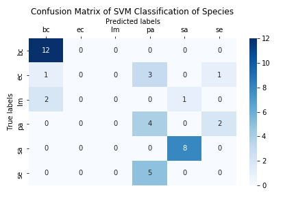
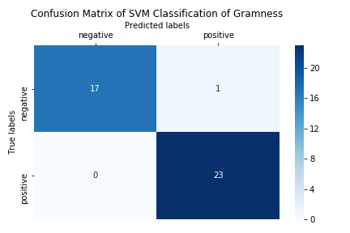

# Classification of Bacteria with Fluorescence Spectra
In this project a series of machine-learning algorithms are used to try classify bacteria based on fluorescence spectra data. Two main series of experiments are done: the first on predicting the species of a given bacteria sample, and the second on predicting whether a given bacteria sample would test positive or negative in the gram stain test.

# Table of Contents

* [1. Getting Started](#1-getting-started)
* [2. Data](#2-data)
* [3. Models](#3-models)
* [4. Methodology](#4-methodology)
* [5. Other Experiments](#5-other-experiments)
    * [5.1. Upsampling](#51-upsampling)
    * [5.2. CNN with Separate Kernels for Each Growth Phase](#52-cnn-with-separate-kernels-for-each-growth-phase)
* [6. Summary of Results](#6-summary-of-results)
    * [6.1. Species Classification](#61-species-classification)
    * [6.2. Gram-ness Classification](#62-gram-ness-classification)
* [Appendix I: SVM Parameters](#appendix-i-svm-parameters)
* [Appendix II: XGBoost Parameters](#appendix-ii-xgboost-parameters)
* [Appendix III: CNN Parameters](#appendix-iii-cnn-parameters)

## 1. Getting Started
1. If you are using conda you can create the conda environment used for the project with command:
    ```shell
    $ conda env create -f environment.yml
    ```

    Otherwise, make sure your python environment is set up with packages listed in the file `environment.yml`
2. Open the jupyter notebook `Data Preparation.ipynb` and run it.
3. Open and run one of the jupyter notebooks in the root directory or in the directory `other_experiments/`.

## 2. Data
The data consists of fluorescence spectra readings from six different species of bacteria: Bacillus cereus, Listeria monocytogenes, Staphylococcus aureus, Salmonella enterica, Escherichia coli, and Pseudomonas aureginosa.
In the dataset these are referred to as 'bc', 'lm', 'sa', 'se', 'ec', and 'pa', respectively.
For each bacteria sample there are fluorescence spectra readings for about 1043 different wavelengths of light (from ~395 nm to ~785 nm) and the three growth phases: lag, log, and stationary. This means that for each bacteria sample there are 3 * 1043 data points. 

Furthermore, the spectra readings are generated with two different integration times, 16ms and 32ms. 
Integration time is the time spent gathering each fluorescence spectra reading. 
Shorter integration times are preferred.

The original csv file (`data/16ms_32ms_growth_phase_spectra.csv`) has the columns 'wavelength', 'bc01_16ms_lag', 'bc02_16ms_lag', ... , 'sa08_32ms_stat'. In order to facilitate eaiser indexing and manipulation of the data I reorganised the data.
The first thing I did was split the data into two sets of data: 16ms integration time data, and 32ms integration time data which are exported as two csv files (`data/bacteria_16ms.csv` and `data/bacteria_32ms.csv`). 
I then reorganised the data so that the columns were hirearchically indexed by growth phase, gram-positive/gram-negative, bacteria species, and then replicate number. 

When using just a single growth phase for classification, the data for just that growth phase is used as-is. 
However when using all growth phases, the bacteria samples that do not have data for all three growth phases are discarded and for each bacteria sample the data from each growth phase are concatenated into a single row. 
There are 47, 41, and 47 bacteria samples for the lag, log and stationary growth phases, respectively. 
There are 39 bacteria samples with data for all three growth phases, and thus the number of samples used when looking at all the growth phases together is also 39. 
The resulting shape of the data when using all growth phases is thus 39 samples by 3129 spectra readings.

There are some large numbers in the dataset (some spectra readings exceed 25,000).
This poses a problem when training SVM models that use the linear kernel as the linear kernel is very slow for large values. 
For example, a SVM using the rbf kernel would take less than ~0.1 second to train while a SVM using the linear kernel could take up to ~16 minutes to train. 
To mitigate this effect I scaled the data into the interval [0.0, 1.0]. 
It should be noted that scaling is done 'globally', rather than scaling each feature individually as is done in the sklearn scaling libraries. 
This retains the relative scale between features. 
It is important to keep the relative scaling between features because technically all the features in this dataset are readings of the same feature. 
Ignoring relative scale and scaling on a per-feature basis worsens classification peformance.

There are two sets of labels used for classification: 
1.  the species of a given bacteria sample, which are:
    - Bacillus cereus
    - Escherichia coli
    - Listeria monocytogenes
    - Pseudomonas aureginosa
    - Staphylococcus aureus 
    - Salmonella enterica

2. the 'gram-ness' of a given bacteria sample, i.e. whether the given bacteria would test positive or negative in the [gram stain test](https://en.wikipedia.org/wiki/Gram_stain). The groupings for the bacteria in the dataset are:
    - Gram-positive
        - Bacillus cereus 
        - Listeria monocytogenes
        - Staphylococcus aureus 

    - Gram-negative
        - Escherichia coli
        - Pseudomonas aureginosa
        - Salmonella enterica

Refer to the notebooks `Data Preparation.ipynb` and `Data Analysis.ipynb` for more details about the dataset and data. 

## 3. Models
The models used in the experiments are:
1. Naive Bayes
2. SVM
3. RandomForest with Decision Stumps
4. RandomForest with Decision Trees
5. AdaBoost with Decision Stumps
6. AdaBoost with Decision Trees
7. XGBoost
8. Convolutional Neural Network

Additionally, the parameters 'C', 'gamma', and 'kernel' are optimised for the SVM model via grid search. The score given for the SVM model is the model initialised with the best parameters found in this parameter search. See [Appendix I: SVM Parameters](#appendix-i-svm-parameters) for more details.

Simliarly, the learning rate and max depth parameters are optimised for the XGBoost model via grid search. The score given for the XGBoost model is the model initialised with the best parameters found in this parameter search. See [Appendix II: XGBoost Parameters](#appendix-ii-xgboost-parameters) for more details.

The AdaBoost and RandomForest models are tested with decision trees using both a max tree depth of one (a.k.a decision stumps) and three. 
RandomForest models are tested with 512 decision trees and AdaBoost with 256 decision trees.


**Table 1.** Convolutional neural network architecture used for generating results. 
*N* in the output shape is the batch size which changes between training and testing.

| Layer (type)                  | # Kernels | Kernel Shape | Output Shape  | # Params    |
|-------------------------------|----------:|-------------:|--------------:|------------:|
| conv1 (Conv1D)                | 32        | 3            | (N, 1041, 32) | 320         |
| conv2 (Conv1D)                | 64        | 3            | (N, 1039, 64) | 6208        |
| pool (GlobalAveragePooling1D) | -         | -            | (N, 64)       | 0           |
| softmax (Dense)               |           |              | (N, 6)*       | 390 (130**) |
|                                                                                        |
| Total params: 6,918 (6,466**)                                                          |
| Trainable params: 6,918 (6,466**)                                                      |
| Non-trainable params: 0                                                                |
| * *(N, 2) If classifying for gram-ness.*                                               |
| ** *If using a single growth phase.*                                                   |

A global average pooling layer is used instead of flattening. It significantly reduces the dimensionality of the output of convolutional layers and allows the output to be fed directly into the softmax layer. 
This way fully connected layers are not necessary and the number of parameters in the model are kept to a minimum. 
The CNN is trained with the RMSprop optimiser using the default settings.

## 4. Methodology
Two series of experiments are run, one for species classifcation and another for gram-ness classification. 
These two series of experiments are identical except for the labels that are being predicted. 
Each of these series of experiments are similar to grid search where I evaluate the classification accuracy for each combination of data subset (all growth phases together or one of 'lag', 'log', or 'stat'), integration time (16ms or 32ms), data transformation (none or PCA), and then model (one of the eight models listed in the previous section). 
One exception is that the CNN model is not evaluated on the PCA data.
This means that, instead of 128 individual scores (4 * 2 * 2 * 8), there are a total of 120 scores generated for each series of experiments.

The PCA tranformed dataset is generated such that 99% of the variance in the data is retained. 
The number of components retained is automatically set to the minimum number of components that are needed to satisfy this condition. 

I utilise cross-validation to make sure the performance achieved by the models are not just achieved by random chance and to assess the variance in scores introduced by the different ways of splitting the data. 
Models are evaluated using repeated stratified k-fold cross validation which does 3-fold cross-validation 20 times. 
This means that for each model, 60 individual instances are fitted and evaluated.
The scores for each model are calculated from the 60 individually fitted instances, and are given as the mean score ± two standard deviations.

To help prevent overfitting the CNN I first train a single instance of the CNN model before performing cross-validation. 
I train the model for 1000 episodes and use early stopping so that training is stopped if the validation loss does not decrease for more than 10 epochs. 
I then round the epoch number that the training stopped on down the nearest 100.
For the number of epochs used in the final experiments see [Appendix III: CNN Parameters](#appendix-iii-cnn-parameters).

The random state is set to the same value across different modules (e.g. train_test_split, RandomForest initialisation) to ensure results can be reproduced consistently. 
I have not covered every case (e.g. CNN weight initialisation), but I believe I have done enough to ensure that the data is always split in the same way and ensemble models like RandomForest have the same sub-models.

Brief summaries of the results are given with a table listing the classification scores of each configuration and a bar chart comparing classification scores across each configuration. 
The numbers on the bars in the bar chart show the height of the bars (the classification score) and the black lines indicate the ± two standard deviations ranges.

The source code for these experiments can be found in python package `experiments`.
The results can be found in the jupyter notebooks `Classification-Species.ipynb` and `Classification-Gramness.ipynb`. A summary of these results are given in the [last section](#6-summary-of-results).

There are also a number of individual notebooks for other independent experiments. Most of these individual experiments are covered in the two jupyter notebooks mentioned above, however there are some experiments that are not. 
The experiements thare not covered in the above notebooks are briefly explained in the next section. 
The code and results for these experiments can be found in the various notebooks under the directory `other_experiments/`. 
The notebooks that may be of interest are the notebooks that deal with upsampling and other CNN architectures, i.e. notebooks that end with `-upsampling.ipynb` or notebooks starting with `CNN-`.

# 5. Other Experiments
I also tried a few different experiments that were not covered by the two main notebooks, `Classification-Species.ipynb` and `Classification-Gramness.ipynb`, and not included in final results. 

## 5.1. Upsampling
The first thing that I tried was upsampling the data so that each class had the same number of instances. 
The dataset was first split into two portions: the first would be used for upsampling, and the second would be used as a test set and held out until the very end. 
Then the SMOTE algorithm would be used on the first portion of the data to create an upsampled training set.
Every class, except for the majority class, was upsampled to have the same number of instances as the majority class. 
A set of the models would then be tested using the same repeated stratified k-fold cross-validation as described previously. 
The best performing model would be selected and have its performance on the held-out test set.   
The results were worse than classification without upsampling. 
However, this may have been due to the way the data was split, and it may be possible to achieve better performance with a different test set. 

## 5.2. CNN with Separate Kernels for Each Growth Phase
In this experiment I tried treating the data like an image and applying 2D convolution. The idea is that a 1D kernel applies the same weights to every growth phase and the kernel may be too general and underfit. Treating the data as a 1043 x 3 image (1043 spectra readings by 3 growth phases) and using a 2D kernel may enable the model to learn kernels that are more specific to each growth phase and end up being more accurate.

The only implementation changes that this required was adding an extra dimension to the feature data, which changed the shape of each sample from 1043 x 3 to 1043 x 3 x 1, and using 2D convolutions with 3 x 3 kernels with 'same' padding.
In my experiments, this method did not provide any improvement in performance over using the same kernel for each growth phase. 
The results can be compared in the jupyter notebooks `CNN-Species.ipynb` and `CNN-Species-Separate-Kernels.ipynb` in the directory `other_experiments/`.

# 6. Summary of Results
Overall, the model that achieves the best classification score for both species classification and gram-nes classification is a SVM using the linear kernel. A summary of the results for species classifcation and gram-ness classifcation are given below. 
For the full results, see the jupyter notebooks `Classification-Species.ipynb` and `Classification-Gramness.ipynb`.

## 6.1. Species Classification
Overall, none of models are able to produce good results when classifying bacteria species. The best classification accuracy was 59% (± 12%) using a SVM and the 32ms integration time data. 
Since, in the case of using all growth phase data, there are about 12 samples in the majority class out of a total of 39 samples, the best score a classifier could get by consistently guessing the majority class would be around 30%. 
So 59% is quite a bit better than random guessing, however it is still too unreliable for practical use. 

**Table 2.** best cross-validation scores classifying for species per growth phase, sorted by 'Mean Score'.

|   | Integration Time | Growth Phase |    Classifier |  Dataset | Mean Score | ± 2 SD |
|---|------------------|--------------|---------------|----------|-----------:|-------:|
| 1 |             32ms |          All |           svm | original |       0.59 |   0.11 |
| 2 |             32ms |         Stat |           svm | original |       0.59 |   0.19 |
| 3 |             32ms |          Lag |           svm | original |       0.54 |   0.19 |
| 4 |             16ms |          Log | random_forest |      pca |       0.50 |   0.17 |

In the below confusion matrix we can see that the best performing model fails to correctly identify the bacteria species Escherichia coli and Listeria monocytogenes. 
It also often confuses Pseudomonas aureginosa and Salmonella enterica for other species. 
However, seems to do a reasonable job of identifying Bacillus cereus and Staphylococcus aureus.
This is most likely due to high similarity in the fluorescence spectra generated by these species. 
It seems that the model might be able to distinguish between just Bacillus cereus, Pseudomonas aureginosa, and Staphylococcus aureus.

**Figure 1.** Confusion matrix of the predictions made by the best performing configuration. 
The model is a SVM using the best parameters (C=1, gamma=0.01, kernel='rbf') and cross-validated on 32ms integration time and all growth phase data.



**Table 3.** Classification report of the predictions made by the best performing configuration. 
The model is a SVM using the best parameters (C=1, gamma=0.01, kernel='rbf') and cross-validated on 32ms integration time and all growth phase data.

|              | precision | recall | f1-score | support |
|-------------:|----------:|-------:|---------:|--------:|
|              |           |        |          |         |
|           bc |      0.80 |   1.00 |     0.89 |      12 |
|           ec |      0.00 |   0.00 |     0.00 |       5 |
|           lm |      0.00 |   0.00 |     0.00 |       3 |
|           pa |      0.33 |   0.67 |     0.44 |       6 |
|           sa |      0.89 |   1.00 |     0.94 |       8 |
|           se |      0.00 |   0.00 |     0.00 |       5 |
|              |           |        |          |         |
|    micro avg |      0.62 |   0.62 |     0.62 |      39 |
|    macro avg |      0.34 |   0.44 |     0.38 |      39 |
| weighted avg |      0.48 |   0.62 |     0.53 |      39 |


## 6.2. Gram-ness Classification
Overall, the classification scores for gram-ness were much better than the scores for species classification. 
Many models were able to achieve 98% (± 2~7%) accuracy on the 16ms integration time log growth phase data. 

**Table 4.** best cross-validation scores classifying for gram-ness per growth phase, sorted by 'Mean Score'.

|   | Integration Time | Growth Phase | Classifier |  Dataset | Mean Score | ± 2 SD |
|---|------------------|--------------|------------|----------|-----------:|-------:|
| 1 |             16ms |          Log |        svm | original |       0.98 |   0.07 |
| 2 |             16ms |          All |        svm | original |       0.97 |   0.07 |
| 3 |             32ms |         Stat |        svm | original |       0.93 |   0.10 |
| 4 |             32ms |          Lag |        svm | original |       0.92 |   0.13 |

The below confusion matrix and classification report confirm that the best performing model does a good job at distinguishing gram-positive and gram-negative bacteria in the dataset.

**Figure 2.** Confusion matrix of the predictions made by the best performing configuration. 
The model is a SVM using the best parameters (C=0.01, gamma=1, kernel='linear') and cross-validated on 16ms integration time and log growth phase data.



**Table 5.** Classification report of the predictions made by the best performing configuration. 
The model is a SVM using the best parameters (C=0.01, gamma=1, kernel='linear') and cross-validated on 16ms integration time and log growth phase data.

|              | precision | recall | f1-score | support |
|-------------:|----------:|-------:|---------:|--------:|
|     negative |      1.00 |   0.94 |     0.97 |      18 |
|     positive |      0.96 |   1.00 |     0.98 |      23 |
|              |           |        |          |         |
|    micro avg |      0.98 |   0.98 |     0.98 |      41 |
|    macro avg |      0.98 |   0.97 |     0.98 |      41 |
| weighted avg |      0.98 |   0.98 |     0.98 |      41 |

# Appendix I: SVM Parameters
It is often necessary to tune the SVM hyperparameters, or at least more so than the other classifiers that were used. 
The three main parameters that are typically optimised in a SVM are  the parameters:  'C', 'gamma', and the kernel.
The below tables list the 'best' combinations of these parameters, as found via grid search, that were used in the experiments in the notebooks `Classification-Species.ipynb` and `Classification-Gramnes.ipynb`, respectively. 

**Table 6.** best SVM parameters for species classification.

| Integration Time | Growth Phase |     C | Gamma | Kernel |
|------------------|--------------|------:|------:|--------|
|             16ms |          Lag |     1 |     1 | Linear |
|             16ms |          Log |     1 |     1 | Linear |
|             16ms |         Stat |   0.1 |     1 | Linear |
|             16ms |          All |  0.01 |     1 | Linear |
|             32ms |          Lag |     1 |     1 | Linear |
|             32ms |          Log |    10 |     1 | Linear |
|             32ms |         Stat |    10 |     1 | Linear |
|             32ms |          All |     1 |  0.01 |    Rbf |

**Table 7.** best SVM parameters for gram-ness classification.

| Integration Time | Growth Phase |     C | Gamma | Kernel |
|------------------|--------------|------:|------:|--------|
|             16ms |          Lag |     1 |     1 | Linear |
|             16ms |          Log |  0.01 |     1 | Linear |
|             16ms |         Stat |     1 | 0.001 |    Rbf |
|             16ms |          All |     1 | 0.001 |    Rbf |
|             32ms |          Lag |   0.1 |     1 | Linear |
|             32ms |          Log |  0.01 |     1 | Linear |
|             32ms |         Stat |     1 | 0.001 |    Rbf |
|             32ms |          All | 0.001 |     1 | Linear |

# Appendix II: XGBoost Parameters
XGBoost has a few hyperparameters that can be tuned. I chose to tune the learning rate and max depth. The below tables list the 'best' combinations of these parameters, as found via grid search, that were used in the experiments in the notebooks `Classification-Species.ipynb` and `Classification-Gramnes.ipynb`, respectively.

**Table 8.** best XGBoost parameters for species classification.

| Integration Time | Growth Phase | Learning Rate | Max Depth |
|------------------|--------------|--------------:|----------:|
|             16ms |          Lag |           0.1 |         1 |
|             16ms |          Log |           0.1 |         1 |
|             16ms |         Stat |         0.001 |         2 |
|             16ms |          All |          0.01 |         1 |
|             32ms |          Lag |           0.1 |         1 |
|             32ms |          Log |          0.01 |         1 |
|             32ms |         Stat |        0.0001 |         1 |
|             32ms |          All |          0.01 |         1 |

**Table 9.** best XGBoost parameters for gram-ness classification.

| Integration Time | Growth Phase | Learning Rate | Max Depth |
|------------------|--------------|--------------:|----------:|
|             16ms |          Lag |           0.1 |         1 |
|             16ms |          Log |        0.0001 |         1 |
|             16ms |         Stat |           0.1 |         2 |
|             16ms |          All |        0.0001 |         1 |
|             32ms |          Lag |           0.1 |         1 |
|             32ms |          Log |        0.0001 |         1 |
|             32ms |         Stat |           0.1 |         1 |
|             32ms |          All |        0.0001 |         1 |

# Appendix III: CNN Parameters
The number of epochs that could be trained for before the model performance stops increasing and starts to overfit (i.e. the validation loss starts to increase) varies based on the subset of the dataset used. As such, the number of epochs that the CNN model is trained for is changed accordingly. The below tables list the number of epochs used in the experiments in the notebooks `Classification-Species.ipynb` and `Classification-Gramnes.ipynb`, respectively.

**Table 10.** number of training epochs used during cross-validation in species classification, for each combination of growth phase and integration.

| Integration Time | Growth Phase | Epochs |
|------------------|--------------|-------:|
|             16ms |          Lag |    100 |
|             16ms |          Log |    100 |
|             16ms |         Stat |    100 |
|             16ms |          All |    100 |
|             32ms |          Lag |    100 |
|             32ms |          Log |    200 |
|             32ms |         Stat |    100 |
|             32ms |          All |    100 |

**Table 11.** number of training epochs used during cross-validation in gram-ness classification, for each combination of growth phase and integration.

| Integration Time | Growth Phase | Epochs |
|------------------|--------------|-------:|
|             16ms |          Lag |    100 |
|             16ms |          Log |    100 |
|             16ms |         Stat |    100 |
|             16ms |          All |    600 |
|             32ms |          Lag |    100 |
|             32ms |          Log |    100 |
|             32ms |         Stat |    100 |
|             32ms |          All |    400 |
